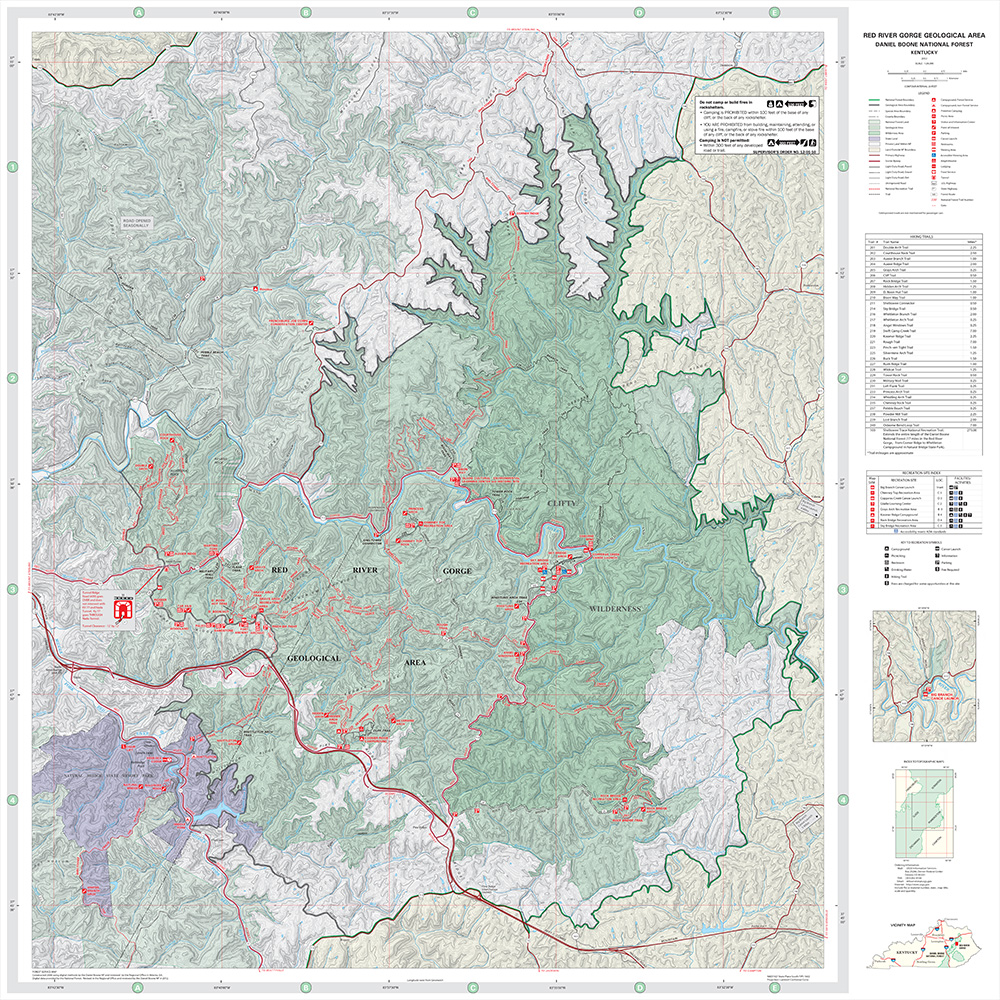
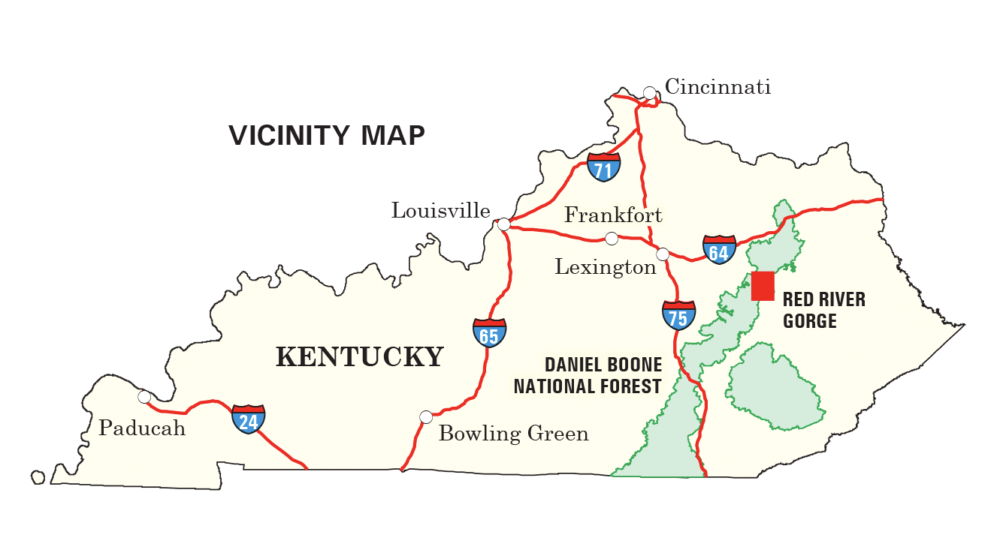

# Welcome to the Red River Gorge

The Red River Gorge is located in the Daniel Boone National Forest and Menifee, Wolfe, and Powell Counties in eastern Kentucky. Visitors commonly refer to the area as "The Gorge" and is famous for its stunning cliffs and geological formations. 

## Facts about the Gorge

1. It is a [National Geological Area](https://www.fs.usda.gov/detail/dbnf/specialplaces/?cid=stelprdb5345319)
2. It is a [National Natural Landmark](https://www.nps.gov/subjects/nnlandmarks/site.htm?Site=RERI-KY)

    
[Download PDF map](https://www.fs.usda.gov/Internet/FSE_DOCUMENTS/stelprdb5364326.pdf)

### Map source
1. [US Forest Service, Daniel Boone NF](https://www.fs.usda.gov/detail/dbnf/specialplaces/?cid=stelprdb5345319)